# LitePay - Web Application for tracking and sharing group expenses

<div align="center">
  
</div>

## Table of Contents
- 🚀 [Project Overview](#project-overview)
- ✨ [Features](#features)
- 💻 [Technologies](#technologies)
- 📋 [Requirements](#requirements)
- 🛠️ [Setup Instructions](#setup-instructions)
- 📸 [Screenshots](#screenshots)

## Project Overview
LitePay is a web application built with the MERN stack (MongoDB, Express, React, Node.js) that makes it easy to split expenses with friends, family, or roommates. It allows users to quickly determine who owes whom and how much after a meeting, trip other event. Additionally, it provides statistics related to personal money management.
> [!NOTE]  
> LitePay web application is only available in Polish language version!

## Features

**Unauthenticated User**
- 📝 Account registration
- 🔑 Login

**Logged-in User**
- ✏️ Editing personal data (first name, last name, email, profile picture, password)
- 👥 Creating, editing, and deleting groups
- ✉️ Inviting other users to groups
- 💸 Adding, deleting, and editing expenses (title, amount, category, date, who paid, and for whom)
- 🔄 Custom expense splits (flexible amount distribution)
- 🕒 Activity timeline to track changes in expenses and groups
- 📊 Group statistics (total group expenses, personal debts/balances)
- 📈 Financial summary (total spending across all groups, list of debtors/creditors, spending charts by day/month/year)
- 🌙 Dark mode of the application 
- 📱 Full responsiveness
- ✨ Clean and simple design

## Technologies
**Backend**
- Express
- Node.js
- MongoDB
- JWT
- bcryptjs
- multer

**Frontend**
- React
- Axios
- chart.js
- formik
- Yup

## Requirements
Software versions used for development:
- React 19.1.0
- Express 5.1.0
- Node.js 24.0.1
- MongoDB Compass 1.46.2
- MongoDB NodeJS Driver 6.16.0
> [!WARNING]  
> Compatibility with earlier versions has not been tested.

## Setup Instructions
To run a project locally, you must have Node.js and npm installed. 
> [!IMPORTANT]  
> *Download guide: [Installing Node.js and npm](https://docs.npmjs.com/downloading-and-installing-node-js-and-npm)*

You must also have the MongoDB Compass app downloaded or the MongoDB Atlas service configured.

1. Download and extract the LitePay-Project folder.
2. If necessary (for example, when using MongoDB Atlas), adjust the `.env` file from the `server` directory. Otherwise, go to **Step 4** (the file is configured by default).
3. (If modified) Sync any changes made in `server/.env` with `client/.env`
4. Navigate to the `server` folder in your terminal.
5. Install dependencies and launch the backend:
```
$ npm install
$ npm start
```
6. Open a new terminal in the `client` folder.
7. Install dependencies and start the frontend:
```
$ npm install
$ npm start
```
8. Access the application at [http://localhost:3000](http://localhost:3000) (or your custom URL if you modified the frontend port in Step 3).

## Screenshots
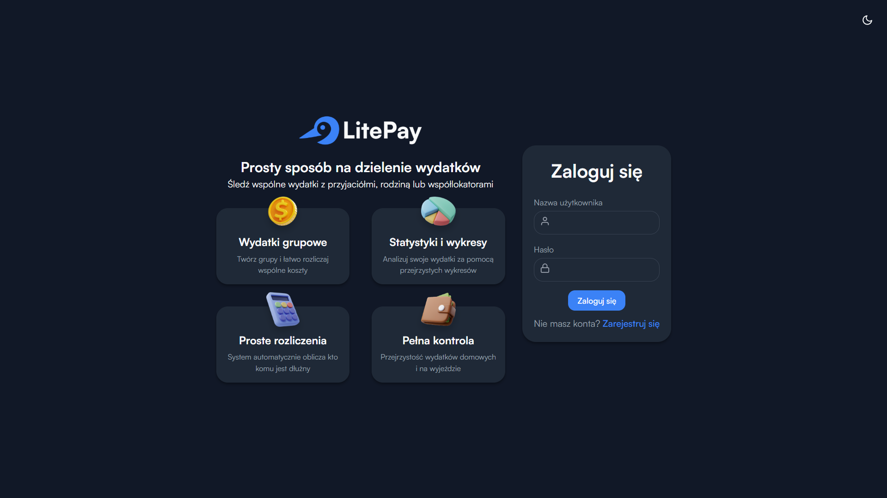
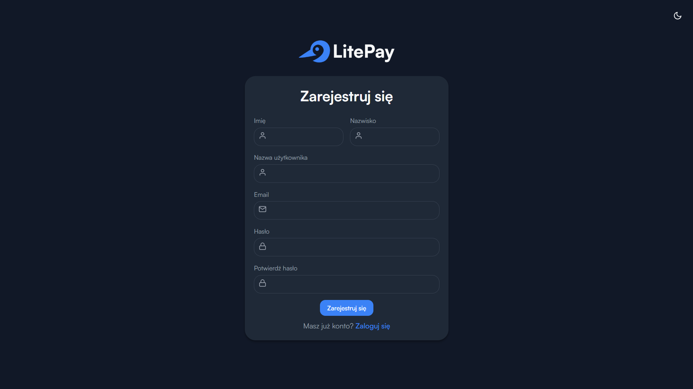
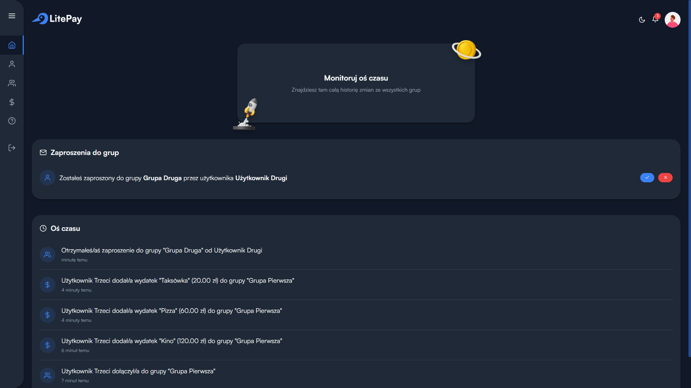
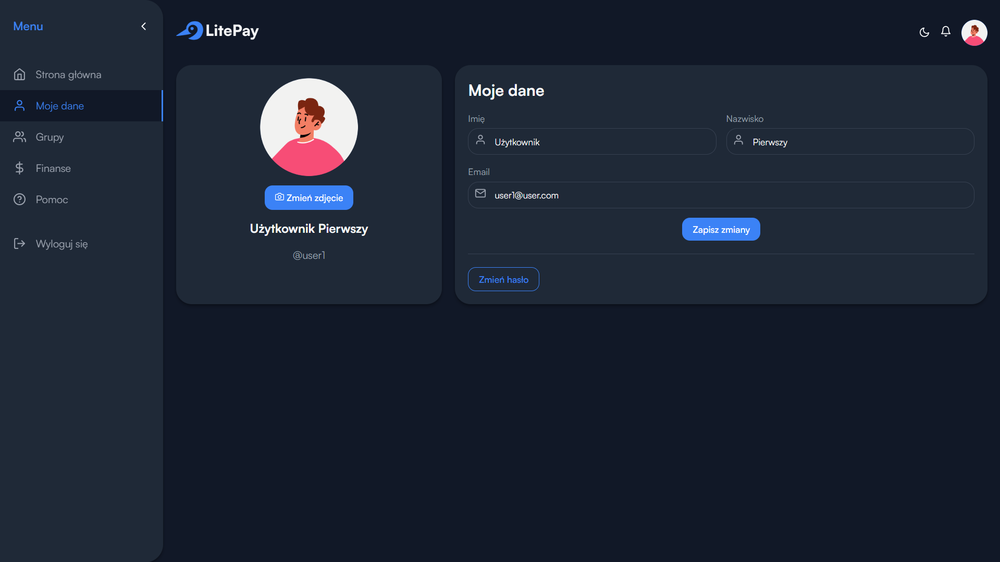
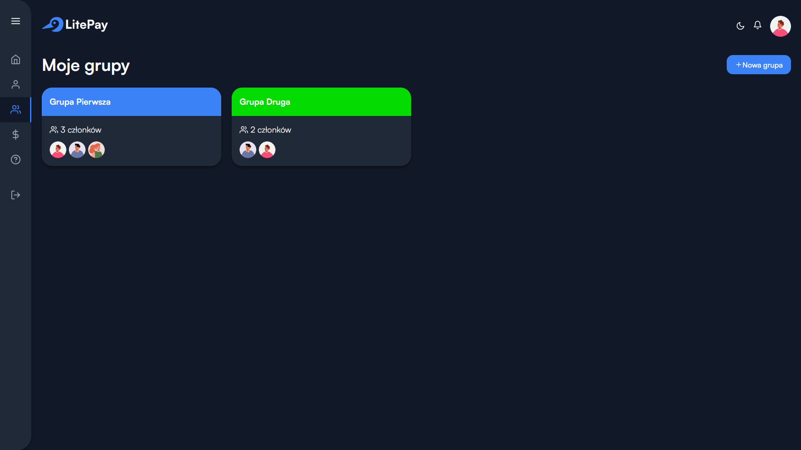
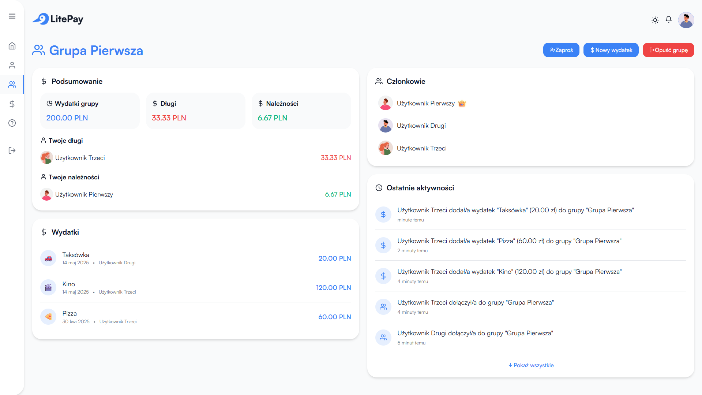
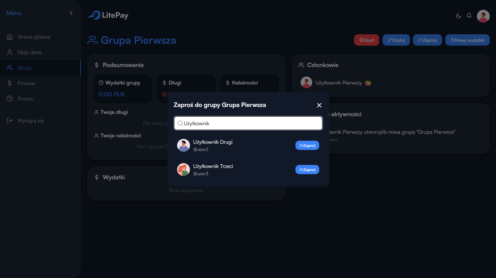
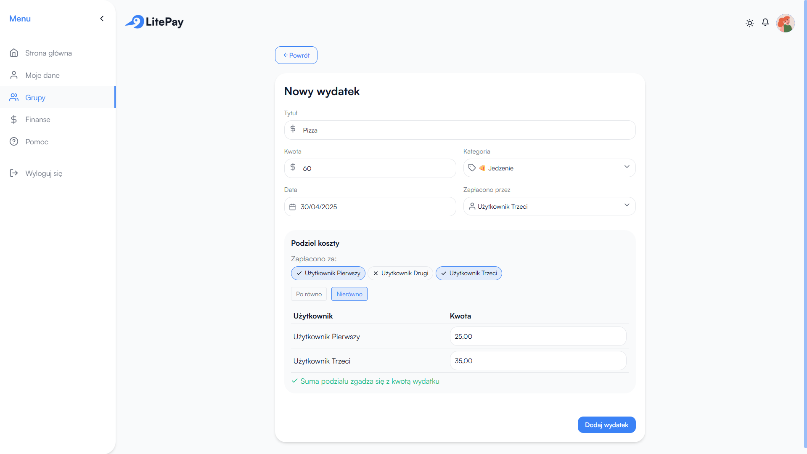
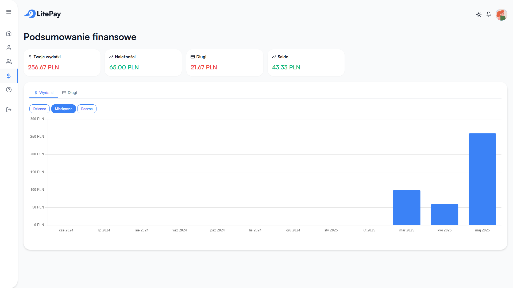

### Mobile Device
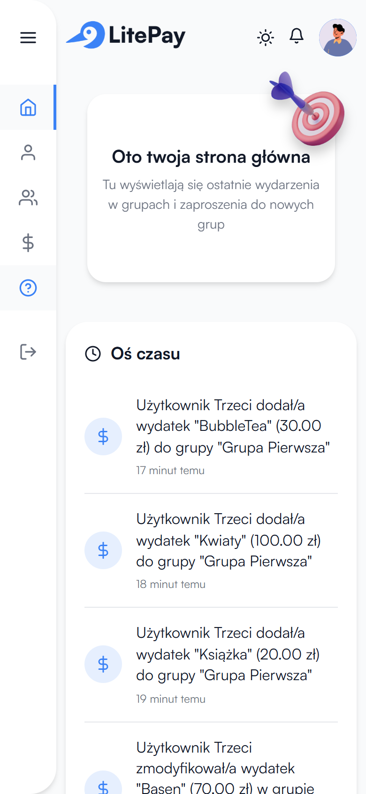 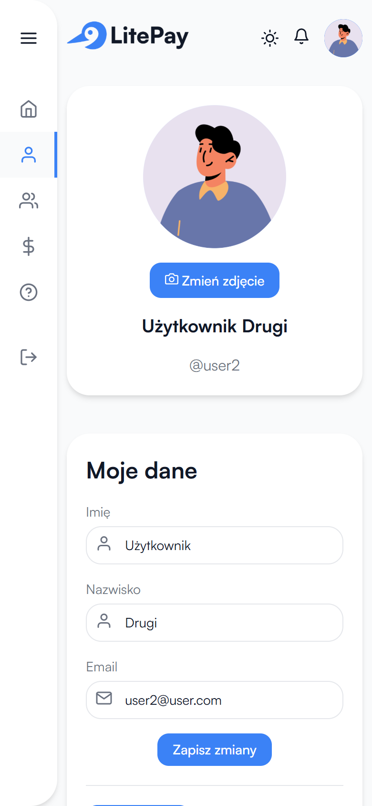
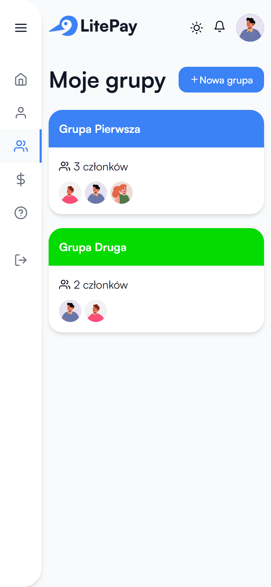 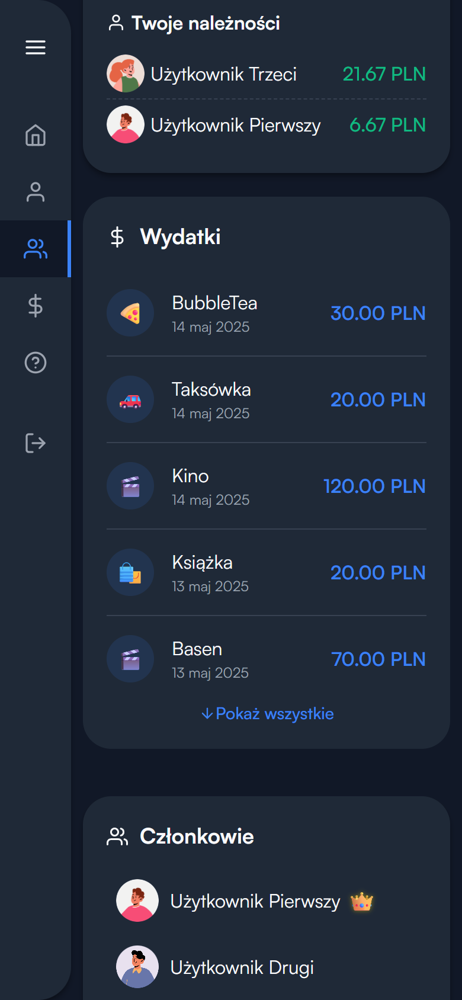
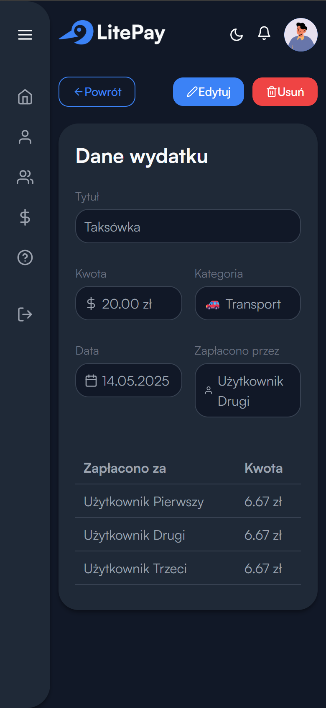 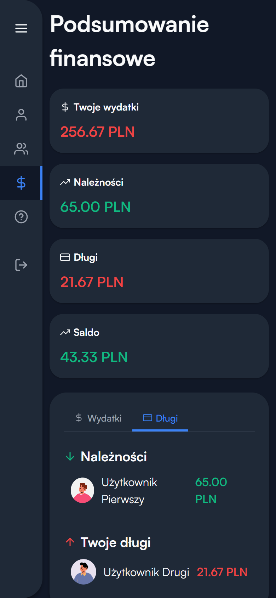
